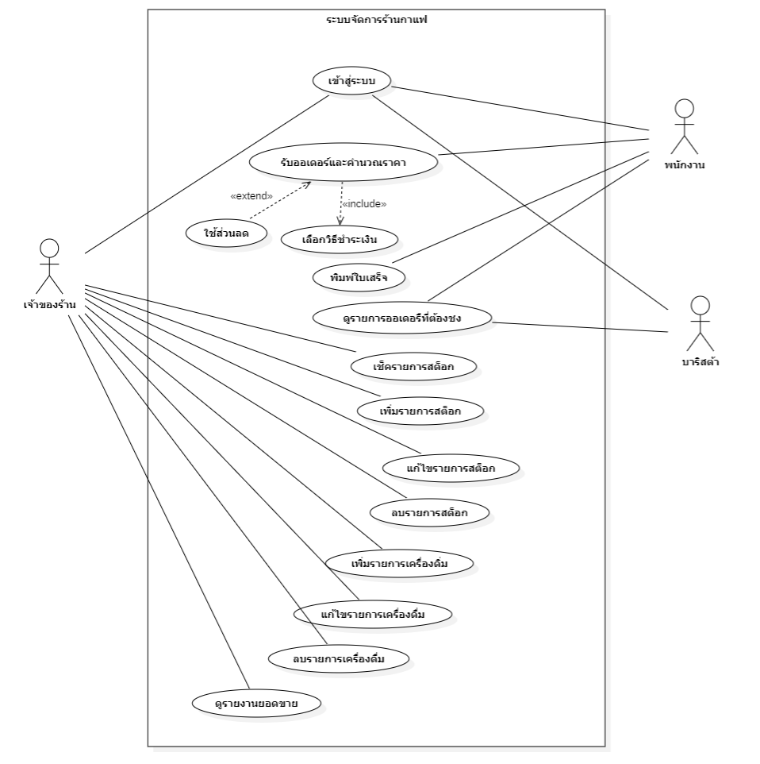

# User Story
แปลง Functional Requirement `(wk03-requirements.md)` แต่ละข้อเป็น User Story

| Functional Requirement | User Story | Acceptance Criteria |
| :--- | :--- | :--- |
| **FR-01:** ระบบต้องสามารถบันทึกรายการออเดอร์ของลูกค้า พร้อมระบุเลขโต๊ะ หรือประเภทการทาน | **As a** พนักงานแคชเชียร์   **I want** เลือกประเภทการทาน เช่น ทานที่ร้าน สั่งกลับบ้าน หรือเดลิเวอรี และระบุเลขโต๊ะได้เมื่อสร้างออเดอร์ใหม่   **So that** ข้อมูลออเดอร์ถูกต้องและตรงกับความต้องการของลูกค้า | **Scenario 1: บันทึกออเดอร์แบบทานที่ร้าน**   • **Given** พนักงานอยู่ในหน้าจอสร้างออเดอร์ใหม่   • **When** พนักงานเลือกประเภทการทานเป็น "ทานที่ร้าน" และกรอกระบุเลขโต๊ะ พร้อมเลือกรายการอาหาร   • **Then** ระบบต้องบันทึกข้อมูลออเดอร์พร้อมแสดงเลขโต๊ะ บนบิลและหน้าจอสรุปออเดอร์อย่างชัดเจน    **Scenario 2: บันทึกออเดอร์แบบกลับบ้าน**   • **Given** พนักงานอยู่ในหน้าจอสร้างออเดอร์ใหม่   • **When** พนักงานเลือกประเภทการทานเป็นกลับบ้าน   • **Then** ระบบต้องข้ามช่องระบุเลขโต๊ะและบันทึกสถานะออเดอร์เป็นประเภทกลับบ้านทันที |
| **FR-02:** ระบบต้องสามารถคำนวณยอดเงินรวม ค่าทอนเงิน และแสดงยอดชำระเงินได้อย่างถูกต้องแม่นยำ | **As a** พนักงานแคชเชียร์   **I want** ให้ระบบคำนวณยอดเงินรวมทั้งหมดของรายการอาหารและคำนวณเงินทอนอัตโนมัติเมื่อป้อนจำนวนเงินที่รับมา   **So that** ป้องกันความผิดพลาดในการทอนเงินและรวดเร็วในการชำระเงิน | **Scenario 1: คำนวณยอดรวมและเงินทอนถูกต้อง**   • **Given** ออเดอร์มียอดชำระรวมทั้งสิ้น 350 บาท   • **When** แคชเชียร์กรอกจำนวนเงินที่รับจากลูกค้ามา 500 บาท   • **Then** ระบบต้องคำนวณและแสดงผลเงินทอนที่ต้องคืนลูกค้าเท่ากับ 150 บาทอย่างถูกต้อง    **Scenario 2: แจ้งเตือนเมื่อเงินสดไม่พอชำระ**   • **Given** ออเดอร์มียอดชำระรวม 350 บาท   • **When** แคชเชียร์กรอกจำนวนเงินที่รับมา 300 บาท   • **Then** ระบบต้องแสดงข้อความแจ้งเตือนว่า "จำนวนเงินไม่เพียงพอ" และไม่อนุญาตให้กดบันทึกการชำระเงิน |
| **FR-03:** ระบบต้องสามารถส่งข้อมูลออเดอร์และแสดงผลลำดับคิวบนหน้าจอฝั่งบาริสต้าได้ | **As a** บาริสต้าหรือพนักงานในครัว   **I want** เห็นรายการออเดอร์ใหม่และลำดับคิวแสดงขึ้นบนหน้าจอฝั่งครัวแบบเรียลไทม์ทันทีเมื่อมีการยืนยันออเดอร์   **So that** สามารถเริ่มเตรียมเครื่องดื่มหรืออาหารตามลำดับก่อน-หลังได้อย่างถูกต้อง | **Scenario 1: ออเดอร์ใหม่ปรากฏบนหน้าจอฝั่งครัวทันที**   • **Given** พนักงานแคชเชียร์กดยืนยันการชำระเงินและส่งออเดอร์เรียบร้อยแล้ว   • **When** ระบบประมวลผลออเดอร์สำเร็จ   • **Then** รายการออเดอร์และหมายเลขคิวจะต้องปรากฏขึ้นบนหน้าจอแสดงผลฝั่งบาริสต้าทันทีโดยไม่ต้องรีเฟรชหน้าจอ    **Scenario 2: อัปเดตสถานะออเดอร์เป็นกำลังเตรียม**   • **Given** บาริสต้าเห็นคิวออเดอร์บนหน้าจอ   • **When** บาริสต้ากดปุ่ม "กำลังทำ" ที่รายการออเดอร์นั้น   • **Then** สถานะบนหน้าจอต้องเปลี่ยนเป็นสีหรือข้อความที่แสดงว่ากำลังดำเนินการ เพื่อให้ทีมงานคนอื่นรับทราบ |
| **FR-04:** ระบบต้องสามารถจัดการข้อมูลวัตถุดิบและตัดจำนวนสต็อกอัตโนมัติหลังการชำระเงินเสร็จสมบูรณ์ | **As a** ผู้จัดการร้าน   **I want** ให้ระบบตัดจำนวนวัตถุดิบในคลังสินค้าโดยอัตโนมัติทันทีที่มีการชำระเงินออเดอร์เสร็จสมบูรณ์   **So that** ข้อมูลสต็อกสินค้าคงเหลือมีความเป็นปัจจุบันเสมอโดยไม่ต้องมาหักลบด้วยมือ | **Scenario 1: ตัดสต็อกวัตถุดิบอัตโนมัติหลังจ่ายเงิน**   • **Given** สต็อกเมล็ดกาแฟ มีจำนวนคงเหลือ 1,000 กรัม และเมนู Latte ใช้เมล็ดกาแฟ 20 กรัม   • **When** ลูกค้าสั่งและชำระเงินค่าเมนู Latte จำนวน 1 แก้วสำเร็จ   • **Then** ระบบต้องทำการหักลบสต็อกเมล็ดกาแฟอัตโนมัติ เหลือจำนวนคงเหลือ 980 กรัมในระบบหลังบ้าน    **Scenario 2: แจ้งเตือนเมื่อวัตถุดิบไม่เพียงพอ**   • **Given** สต็อกนมสด เหลืออยู่ 50 มิลลิลิตร และเมนูที่สั่งต้องใช้นมสด 150 มิลลิลิตร   • **When** พนักงานพยายามบันทึกขายเมนูนั้น   • **Then** ระบบต้องแจ้งเตือนว่า "วัตถุดิบในสต็อกไม่เพียงพอ" เพื่อให้ตรวจสอบก่อนทำรายการ |
| **FR-05:** ระบบต้องสามารถแสดงผลจำนวนคงเหลือของวัตถุดิบในคลังสินค้า โดยจำแนกตามหมวดหมู่ได้อย่างชัดเจน | **As a** พนักงานสต็อกสินค้าหรือผู้จัดการร้าน   **I want** ดูรายการวัตถุดิบคงเหลือในคลังที่ถูกจัดแยกเป็นหมวดหมู่   **So that** สามารถตรวจสอบปริมาณสินค้าแต่ละหมวดหมู่ได้อย่างรวดเร็วและวางแผนสั่งซื้อได้ง่ายขึ้น | **Scenario 1: แสดงหมวดหมู่วัตถุดิบชัดเจน**  • **Given** ผู้ใช้งานเข้าสู่หน้าจอจัดการคลังสินค้า  • **When** ระบบแสดงรายการวัตถุดิบทั้งหมด   • **Then** วัตถุดิบจะต้องถูกจัดกลุ่มแสดงผลแยกตามหมวดหมู่อย่างเป็นระเบียบ    **Scenario 2: ค้นหาและกรองวัตถุดิบตามหมวดหมู่**   • **Given** ผู้ใช้อยู่ในหน้าจอคลังสินค้า   • **When** ผู้ใช้คลิกเลือกตัวกรองเฉพาะหมวดหมู่ผลิตภัณฑ์นม   • **Then** ระบบต้องแสดงเฉพาะรายการวัตถุดิบที่อยู่ในหมวดนมพร้อมจำนวนคงเหลือปัจจุบันทันที |
| **FR-06:** ระบบต้องสามารถออกใบเสร็จรับเงินให้แก่ลูกค้าได้ | **As a** ลูกค้าหรือพนักงานแคชเชียร์   **I want** ให้ระบบสามารถพิมพ์หรือออกใบเสร็จรับเงินที่มีรายละเอียดรายการสินค้า, ราคา และยอดรวมได้อย่างครบถ้วน   **So that** ลูกค้ามีหลักฐานการชำระเงินและร้านค้ามีหลักฐานอ้างอิงในการตรวจสอบยอด | **Scenario 1: พิมพ์ใบเสร็จอัตโนมัติหลังชำระเงินสำเร็จ**   • **Given** พนักงานทำการบันทึกรับเงินและปิดการขายออเดอร์เรียบร้อยแล้ว   • **When** การทำรายการเสร็จสิ้นสมบูรณ์   • **Then** ระบบต้องสั่งพิมพ์ใบเสร็จผ่านเครื่องพิมพ์โดยอัตโนมัติ หรือแสดงตัวเลือกดาวน์โหลดใบเสร็จดิจิทัล    **Scenario 2: ข้อมูลในใบเสร็จครบถ้วนถูกต้อง**   • **Given** ใบเสร็จถูกพิมพ์ออกมาจากระบบ   • **When** ตรวจสอบเนื้อหาภายในใบเสร็จ   • **Then** ต้องปรากฏชื่อร้าน, วันที่-เวลา, รายการสินค้าที่สั่ง, จำนวนเงินรวม, และจำนวนเงินทอนอย่างถูกต้องครบถ้วน |
| **FR-07:** ระบบต้องสามารถสรุปและแสดงรายงานยอดขายรายวัน รายเดือน และแยกตามสาขาได้ | **As a** เจ้าของร้านหรือผู้บริหาร   **I want** เรียกดูรายงานสรุปยอดขายทั้งแบบรายวัน รายเดือน และสามารถแยกดูตามรายสาขาได้   **So that** นำข้อมูลมาวิเคราะห์ผลประกอบการและวางแผนธุรกิจได้อย่างแม่นยำ | **Scenario 1: เรียกดูรายงานยอดขายรายวันและรายเดือน**   • **Given** ผู้บริหารเข้าสู่หน้าจอรายงานยอดขาย  • **When** ผู้บริหารเลือกช่วงเวลาดูรายงานเป็นรายวันหรือรายเดือน   • **Then** ระบบต้องแสดงกราฟหรือตารางสรุปยอดขายรวมของช่วงเวลานั้น ๆ ได้อย่างถูกต้อง    **Scenario 2: กรองรายงานแยกตามสาขา**   • **Given** ร้านค้ามีระบบรองรับหลายสาขา และผู้บริหารต้องการตรวจสอบยอดเฉพาะสาขา   • **When** ผู้บริหารเลือกฟิลเตอร์ระบุสาขา A   • **Then** ระบบต้องแสดงผลสรุปยอดขายเฉพาะของสาขา A โดยไม่นำยอดของสาขาอื่นมารวม |
| **FR-08:** ระบบต้องสามารถวิเคราะห์ข้อมูลยอดขายเพื่อแสดงอันดับเมนูยอดนิยมได้ | **As a** เจ้าของร้านหรือฝ่ายการตลาด   **I want** ระบบจัดอันดับและแสดงรายชื่อเมนูขายดี จากข้อมูลประวัติการขาย   **So that** ทราบว่าเมนูใดได้รับความนิยมสูงสุด เพื่อนำไปใช้จัดโปรโมชันหรือวางแผนวัตถุดิบได้เหมาะสม | **Scenario 1: แสดงรายการเมนูยอดนิยม**   • **Given** มีประวัติการขายสินค้าสะสมภายในระบบ   • **When** ผู้ใช้งานเปิดหน้าจอวิเคราะห์เมนูยอดนิยม  • **Then** ระบบต้องแสดงรายการเมนูอาหารหรือเครื่องดื่มเรียงลำดับจากยอดขายสูงสุดไปต่ำสุดพร้อมจำนวนแก้วหรือจานที่ขายได้    **Scenario 2: กรองอันดับเมนูตามช่วงเวลาที่กำหนด**   • **Given** ผู้ใช้อยู่ในหน้าจอวิเคราะห์เมนูยอดนิยม   • **When** ผู้ใช้กำหนดช่วงเวลาค้นหาเป็นสัปดาห์นี้หรือเดือนนี้   • **Then** ระบบต้องทำการคำนวณและแสดงผลอันดับเมนูยอดนิยมเฉพาะในช่วงเวลาที่ถูกเลือกนั้นทันที |

# Use Case Diagram
### Actor ที่เกี่ยวข้องกับระบบร้านกาแฟ
1. พนักงาน
2. บาริสต้า
3. เจ้าของร้าน

## Use Case Description

**Use Case:** รับออเดอร์และคำนวณราคา

**Actor:** พนักงาน

**Precondition:**
พนักงานเข้าสู่ระบบเรียบร้อยแล้ว และระบบพร้อมรับออเดอร์

**Main Flow:**
1. พนักงานเลือกเมนูอาหารหรือเครื่องดื่มที่ลูกค้าต้องการ
2. ระบบแสดงรายการและราคาของสินค้าที่เลือก
3. พนักงานเลือกประเภทการทาน เช่น ทานที่ร้านหรือกลับบ้าน
4. หากทานที่ร้าน พนักงานระบุเลขโต๊ะ
5. ระบบคำนวณยอดรวมของออเดอร์
6. พนักงานเลือกวิธีชำระเงิน
7. พนักงานรับเงินจากลูกค้า
8. ระบบตรวจสอบจำนวนเงินที่รับ
9. ระบบคำนวณเงินทอน
10. ระบบบันทึกออเดอร์และสถานะการชำระเงิน
11. ระบบส่งข้อมูลออเดอร์ไปยังบาริสต้า
12. ระบบออกใบเสร็จให้ลูกค้า

**Alternative Flow:**

3a. ลูกค้าเลือกทานแบบกลับบ้าน
- ระบบไม่ต้องให้ระบุเลขโต๊ะ
- ดำเนินการต่อไปยังขั้นตอนเลือกวิธีชำระเงิน

5a. ลูกค้าใช้ส่วนลด
- พนักงานเลือกส่วนลดที่สามารถใช้ได้
- ระบบคำนวณยอดเงินหลังหักส่วนลด
- ดำเนินการต่อไปยังขั้นตอนเลือกวิธีชำระเงิน

**Exception Flow:**

8a. จำนวนเงินไม่เพียงพอ
- ระบบแจ้งเตือนว่า "จำนวนเงินไม่เพียงพอ"
- ระบบไม่บันทึกการชำระเงิน
- พนักงานรับเงินเพิ่มหรือแก้ไขจำนวนเงิน

8b. วัตถุดิบไม่เพียงพอ
- ระบบแจ้งเตือนว่าวัตถุดิบไม่เพียงพอ
- ระบบไม่อนุญาตให้ยืนยันออเดอร์ที่ไม่สามารถจัดเตรียมได้

**Postcondition:**

- **สำเร็จ:** ระบบบันทึกออเดอร์และการชำระเงิน ส่งออเดอร์ไปยังบาริสต้า และออกใบเสร็จ
- **ไม่สำเร็จ:** ระบบไม่บันทึกการชำระเงินหรือออเดอร์ที่มีปัญหา และแสดงข้อความแจ้งข้อผิดพลาด

## Use Story & Acceptance Criteria

| # | User Story | Acceptance Criteria |
| :--- | :--- | :--- |
| **US-01: รับออเดอร์และคำนวณราคา** | **As a:** พนักงาน  **I want:** เลือกรายการสินค้าและให้ระบบคำนวณยอดรวมอัตโนมัติ **So that:** สามารถรับออเดอร์และทราบยอดที่ลูกค้าต้องชำระได้อย่างถูกต้อง | **AC-01: ต้องมีรายการสินค้า**  • **Given** พนักงานกำลังสร้างออเดอร์ • **When** พนักงานยืนยันออเดอร์โดยไม่มีรายการสินค้า • **Then** ระบบต้องแสดงข้อความว่า "ต้องมีรายการสินค้าอย่างน้อย 1 รายการ" และไม่บันทึกออเดอร์  **AC-02:** ข้อมูลสินค้าต้องครบถ้วน  •  **Given** พนักงานกำลังสร้างออเดอร์ • **When** รายการสินค้าใดไม่มีชื่อสินค้า หรือข้อมูลที่จำเป็นไม่ครบ • **Then** ระบบต้องแสดงข้อความแจ้งข้อมูลที่ไม่ครบ และไม่บันทึกออเดอร์  **AC-03:** ราคาสินค้าต้องมากกว่า 0  • **Given** พนักงานกำลังสร้างออเดอร์ • **When** รายการสินค้าใดมีราคาน้อยกว่าหรือเท่ากับ 0 • **Then** ระบบต้องแสดงข้อความว่า "ราคาสินค้าต้องมากกว่า 0" และไม่บันทึกออเดอร์  **AC-04:** จำนวนสินค้าต้องมากกว่า 0  • **Given** พนักงานกำลังสร้างออเดอร์ • **When** รายการสินค้าใดมีจำนวนน้อยกว่าหรือเท่ากับ 0 • **Then** ระบบต้องแสดงข้อความว่า "จำนวนสินค้าต้องมากกว่า 0" และไม่บันทึกออเดอร์  **AC-05:** คำนวณยอดรวมถูกต้อง   • **Given** พนักงานเลือกสินค้าและระบุราคาและจำนวนถูกต้อง • **When** พนักงานยืนยันออเดอร์ • **Then** ระบบต้องคำนวณยอดรวมจากราคาสินค้า × จำนวน และแสดงยอดรวมที่ถูกต้อง |
| **US-02: ระบุประเภทการทาน** | **As a:** พนักงาน **I want:** ระบุประเภทการทานของลูกค้าว่าทานที่ร้านหรือกลับบ้าน **So that:** ระบบสามารถจัดการข้อมูลออเดอร์ได้ถูกต้อง | **AC-01:** ทานที่ร้านต้องระบุเลขโต๊ะ  • **Given** พนักงานเลือกประเภทการทานเป็น "ทานที่ร้าน" • **When** พนักงานยืนยันออเดอร์โดยไม่ได้ระบุเลขโต๊ะ • **Then** ระบบต้องแสดงข้อความว่า "กรุณาระบุเลขโต๊ะ" และไม่ยืนยันออเดอร์  **AC-02:** กลับบ้านไม่ต้องระบุเลขโต๊ะ  • **Given** พนักงานเลือกประเภทการทานเป็น "กลับบ้าน" • **When** พนักงานยืนยันออเดอร์โดยไม่ได้ระบุเลขโต๊ะ • **Then** ระบบต้องยอมรับออเดอร์และดำเนินการต่อโดยไม่ต้องระบุเลขโต๊ะ |
| **US-03: ใช้ส่วนลด** | **As a:** พนักงาน **I want:** เลือกส่วนลดที่สามารถใช้กับออเดอร์ได้ **So that:** ระบบสามารถคำนวณยอดชำระหลังหักส่วนลดได้อย่างถูกต้อง | **AC-01:** คำนวณยอดหลังหักส่วนลด  • **Given** พนักงานมีออเดอร์ที่สามารถใช้ส่วนลดได้ • **When** พนักงานเลือกส่วนลดและยืนยันการใช้ส่วนลด • **Then** ระบบต้องคำนวณยอดชำระใหม่โดยหักส่วนลดออกจากยอดรวม |
| **US-04: ชำระเงินและคำนวณเงินทอน** | **As a:** พนักงาน **I want:** รับเงินจากลูกค้าและให้ระบบตรวจสอบจำนวนเงินพร้อมคำนวณเงินทอน **So that:** สามารถรับชำระเงินได้อย่างถูกต้อง | **AC-01:** ตรวจสอบจำนวนเงิน  • **Given** ระบบแสดงยอดเงินที่ลูกค้าต้องชำระ • **When** พนักงานกรอกจำนวนเงินที่ลูกค้าชำระ • **Then** ระบบต้องตรวจสอบว่าจำนวนเงินที่รับเพียงพอกับยอดที่ต้องชำระหรือไม่  **AC-02:** เงินไม่เพียงพอ  • **Given** ยอดเงินที่ต้องชำระมากกว่าจำนวนเงินที่ลูกค้าจ่าย • **When** พนักงานยืนยันการชำระเงิน Then ระบบต้องแสดงข้อความว่า "จำนวนเงินไม่เพียงพอ" และไม่บันทึกการชำระเงิน  **AC-03:** คำนวณเงินทอน   • **Given** จำนวนเงินที่ลูกค้าจ่ายมากกว่าหรือเท่ากับยอดที่ต้องชำระ • **When** พนักงานยืนยันการชำระเงิน • **Then** ระบบต้องคำนวณเงินทอนจากจำนวนเงินที่รับลบด้วยยอดที่ต้องชำระ |
| **US-05: ตรวจสอบวัตถุดิบ** | **As a:** พนักงาน **I want:** ให้ระบบตรวจสอบวัตถุดิบก่อนยืนยันออเดอร์ **So that:** ไม่รับออเดอร์ที่ไม่สามารถจัดเตรียมได้ | **AC-01:** วัตถุดิบเพียงพอ  • **Given** พนักงานกำลังยืนยันออเดอร์ • **When** ระบบตรวจสอบแล้วพบว่าวัตถุดิบของสินค้าทุกรายการมีเพียงพอ • **Then** ระบบต้องอนุญาตให้ยืนยันออเดอร์ได้  **AC-02:** วัตถุดิบไม่เพียงพอ  • **Given** พนักงานกำลังยืนยันออเดอร์ • **When** ระบบตรวจสอบแล้วพบว่าวัตถุดิบของสินค้าใดไม่เพียงพอ • **Then** ระบบต้องแสดงข้อความว่า "วัตถุดิบไม่เพียงพอ" และไม่อนุญาตให้ยืนยันออเดอร์ |
| **US-06: บันทึกและดำเนินการออเดอร์** | **As a:** พนักงาน **I want:** ให้ระบบบันทึกออเดอร์ ส่งข้อมูลให้บาริสต้า และออกใบเสร็จ **So that:** ออเดอร์สามารถดำเนินการต่อและลูกค้าได้รับหลักฐานการชำระเงิน | **AC-01:** บันทึกออเดอร์  • **Given** พนักงานรับออเดอร์และลูกค้าชำระเงินสำเร็จ • **When** ระบบยืนยันการชำระเงิน • **Then** ระบบต้องบันทึกออเดอร์และสถานะการชำระเงิน  **AC-02:** ส่งออเดอร์ให้บาริสต้า  • **Given** ออเดอร์ถูกบันทึกและชำระเงินสำเร็จ • **When** ระบบดำเนินการหลังจากยืนยันการชำระเงิน • **Then** ระบบต้องส่งข้อมูลออเดอร์ไปยังบาริสต้า  **AC-03:** ออกใบเสร็จ  • **Given** ลูกค้าชำระเงินสำเร็จและระบบบันทึกออเดอร์แล้ว • **When** ระบบดำเนินการหลังการชำระเงิน • **Then** ระบบต้องออกใบเสร็จให้ลูกค้า |

---
---