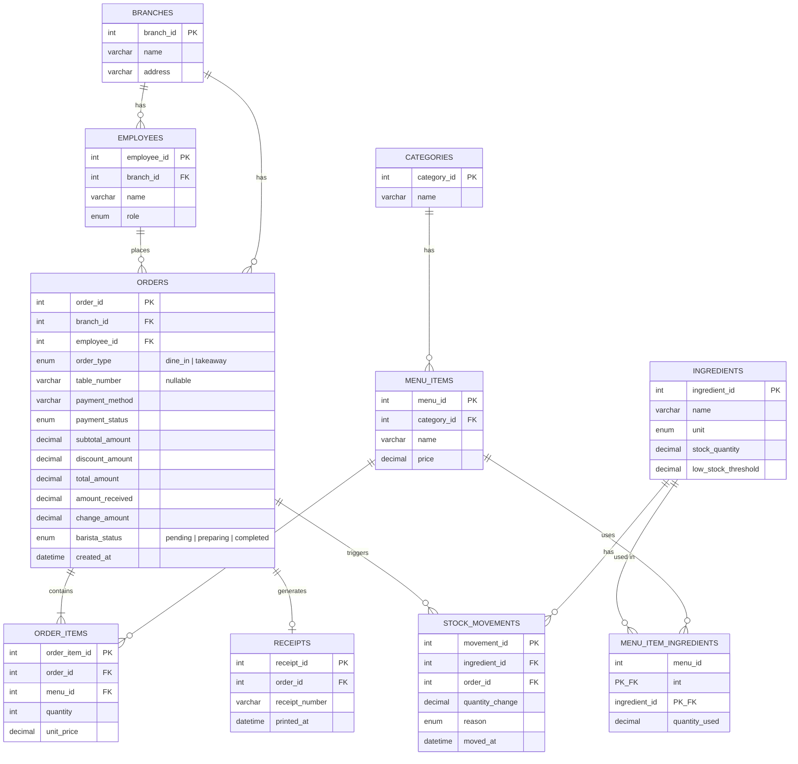

# Week 7 — ER Diagram

> ER Diagram ของระบบ Cafe POS Week 7
> ใช้เป็น Source of Truth สำหรับ `schema.sql` และ Model

---

## สรุป Relationship

| ความสัมพันธ์ | ประเภท | อธิบาย |
|---|---|---|
| BRANCHES → EMPLOYEES | 1:M | 1 สาขามีหลายพนักงาน |
| BRANCHES → ORDERS | 1:M | 1 สาขามีหลายออเดอร์ |
| EMPLOYEES → ORDERS | 1:M | 1 พนักงานสร้างหลายออเดอร์ |
| CATEGORIES → MENU_ITEMS | 1:M | 1 หมวดหมู่มีหลายเมนู |
| ORDERS → ORDER_ITEMS | 1:M | 1 ออเดอร์มีหลายรายการสินค้า |
| MENU_ITEMS → ORDER_ITEMS | 1:M | 1 เมนูถูกสั่งในหลายออเดอร์ |
| MENU_ITEMS ↔ INGREDIENTS | M:N | ผ่าน junction table `MENU_ITEM_INGREDIENTS` |
| INGREDIENTS → STOCK_MOVEMENTS | 1:M | 1 วัตถุดิบมีหลายรายการเคลื่อนไหว |
| ORDERS → STOCK_MOVEMENTS | 1:M | 1 ออเดอร์ทำให้เกิดหลายรายการเคลื่อนไหวสต็อก (nullable) |
| ORDERS → RECEIPTS | 1:1 | 1 ออเดอร์สร้างได้ 1 ใบเสร็จ (หรืออาจพริ้นท์ซ้ำแต่ใช้เลขเดียวกัน) |
