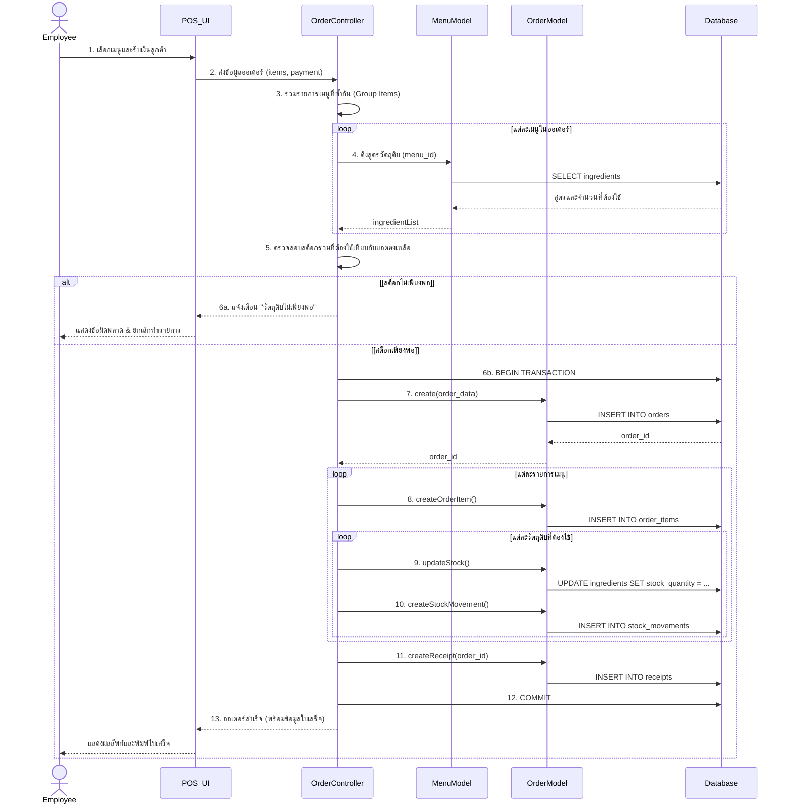
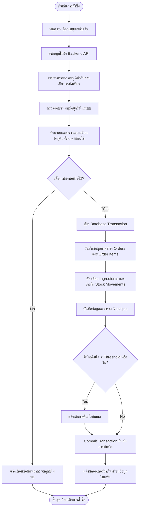

# เอกสารเตรียมพร้อมการออกแบบ Sequence Diagram & Business Rules (Week 9)

เอกสารนี้จัดทำขึ้นเพื่อใช้วิเคราะห์และเตรียมการออกแบบระบบร้านกาแฟ (Cafe POS) ประจำ Week 9 โดยอ้างอิงจากโครงสร้าง Database ปัจจุบัน (10 ตาราง) และ Flow การทำงานจริงของโปรเจกต์

---

## 1. สรุปข้อมูลระบบที่ตรวจพบจากโปรเจกต์
จากการวิเคราะห์ `schema.sql`, `wk07-sequence-diagram.md` และโครงสร้าง MVC ปัจจุบัน พบข้อมูลดังนี้:
* **การจัดการออเดอร์:** ใช้ตาราง `orders`, `order_items` และสร้างใบเสร็จใน `receipts`
* **การจัดการสต็อก:** ระบบ **ไม่ได้ตัดสต็อกที่ระดับเมนู แต่ตัดที่ระดับวัตถุดิบ (Ingredients)** โดยคำนวณผ่านตาราง `menu_item_ingredients`
* **การป้องกันข้อมูล:** การบันทึกออเดอร์ บันทึกไอเทม และตัดสต็อก ควรทำภายใต้ **Database Transaction** เพื่อป้องกันข้อมูลไม่สมบูรณ์
* **โครงสร้างโค้ด:** แยกการทำงานชัดเจนระหว่าง `POS UI` (หน้าบ้าน), `OrderController` (จัดการ Logic), `MenuModel/OrderModel` (จัดการ Database)

---

## 2. Sequence Diagram ของ Flow การสั่งซื้อ

### A. สรุป Flow การสั่งซื้อ
พนักงานสั่งออเดอร์ → POS ส่งข้อมูลไป API → Controller ทำการรวมเมนูที่สั่งซ้ำ → ดึงข้อมูลสูตรส่วนผสม (Ingredients) → ตรวจสอบสต็อกคงเหลือ → หากพอ ให้เปิด Transaction → บันทึก Order, Order Items, Receipts → หักสต็อกและบันทึก Stock Movements → Commit Transaction → แจ้งผลสำเร็จ

### B. ตาราง Participant
| Participant | หน้าที่ | เหตุผลที่เลือกใช้ |
|---|---|---|
| **Employee** | Actor ผู้ใช้งานระบบ | เป็นจุดเริ่มต้นของ Use Case การสั่งซื้อ |
| **POS_UI** | หน้าจอระบบขายหน้าร้าน | ทำหน้าที่รับ Input จากพนักงาน และแสดงผลลัพธ์ |
| **OrderController** | ตัวควบคุม Business Logic | รวมรายการเมนู, คำนวณราคา, และควบคุมขั้นตอนการบันทึกข้อมูล |
| **Models (Menu/Order)** | ตัวกลางจัดการข้อมูล (Data Access) | แยกส่วนการรัน SQL Query เพื่อให้ Controller ไม่ต้องผูกติดกับ DB ตรงๆ |
| **Database** | ฐานข้อมูล MySQL | เป็นแหล่งเก็บข้อมูลหลักและรองรับ Transaction (ACID) |

### C. ตาราง Message (ไฮไลท์ส่วนสำคัญ)
| ลำดับ | ผู้ส่ง | ผู้รับ | ข้อความที่ส่ง (Message) | ผลลัพธ์ที่คาดหวัง |
|---|---|---|---|---|
| 1 | Employee | POS_UI | เลือกเมนูและระบุจำนวน | นำเข้าตะกร้าสินค้า |
| 2 | POS_UI | OrderController | `POST /api/orders` (ข้อมูลออเดอร์) | เริ่มกระบวนการรับออเดอร์ |
| 3 | OrderController | OrderController | `groupDuplicateItems(items)` | รวมจำนวนเมนูที่ ID ซ้ำกัน |
| 4 | OrderController | Models | ตรวจสอบจำนวนสต็อกวัตถุดิบ | ได้ข้อมูลว่าสต็อกพอหรือไม่ |
| 5 | OrderController | Database | `BEGIN TRANSACTION` | ล็อกการเขียนข้อมูล |
| 6 | OrderController | Models | บันทึกข้อมูลและหักสต็อก | ข้อมูลถูกบันทึกลง Database |
| 7 | OrderController | Database | `COMMIT` หรือ `ROLLBACK` | ยืนยันหรือยกเลิกการบันทึกข้อมูล |

### D. Sequence Diagram (Mermaid)


### E. คำอธิบาย Fragment
* **loop (บรรทัดที่ 3 และ 8):** ใช้เพื่อวนลูปดึงสูตรอาหารของแต่ละเมนู และวนลูปเพื่อ Insert สินค้า/ตัดสต็อกวัตถุดิบทีละรายการ
* **alt (บรรทัดที่ 5):** ใช้แยกเงื่อนไข (Decision) กรณีที่วัตถุดิบพอ ระบบจะเริ่ม Transaction บันทึกข้อมูล แต่ถ้าไม่พอ ระบบจะตอบกลับ Error ทันทีโดยไม่มีการบันทึกใดๆ (Protect Data Integrity)

### F. รายละเอียด API Endpoint และ Payload (จาก POS_UI ไป OrderController)
คำถามคือ: Endpoint ที่มีอยู่ (`POST /`, `GET /`, `DELETE /:id`, `DELETE /:orderId/items/:itemId`) **เพียงพอต่อ Use Case หรือไม่?**
**คำตอบ:** **เพียงพออย่างแน่นอนครับ** สำหรับ Use Case "การรับออเดอร์และคิดเงิน" เราจะใช้แค่ `POST /api/orders` เพียงตัวเดียว เพราะเวลาพนักงานเลือกเมนูหรือลบเมนูเข้าๆ ออกๆ มันจะเกิดขึ้นที่ฝั่งหน้าจอ (Frontend/POS_UI) ก่อน พอพนักงานกดยืนยันปุ๊บ ระบบถึงจะมัดรวมข้อมูลทั้งหมดส่งมาให้ Backend บันทึกในทีเดียวครับ

**1. Request Endpoint:** `POST /api/orders`
**หน้าที่:** บันทึกข้อมูลออเดอร์, ตัดสต็อก, คำนวณยอดเงิน, เงินทอน และสร้างใบเสร็จแบบครบจบใน Transaction เดียว

**2. ข้อมูลที่ส่งไป (Request Payload Body):**
```json
{
  "branchId": 1,
  "employeeId": 101,
  "orderType": "dine_in",
  "tableNumber": "A5",
  "paymentMethod": "cash",
  "discountAmount": 10.00,
  "amountReceived": 500.00,
  "items": [
    { "menuId": 1, "quantity": 2 },
    { "menuId": 5, "quantity": 1 }
  ]
}
```
*(หมายเหตุ: POS_UI ไม่ต้องส่งราคารวมมา เพราะ Backend จะคำนวณจากราคาในตาราง Menu เองเพื่อความปลอดภัย)*

**3. ข้อมูลที่ตอบกลับ (Response):**
```json
{
  "status": "success",
  "message": "Order successfully created",
  "data": {
    "orderId": 50,
    "totalAmount": 150.00,
    "changeAmount": 350.00,
    "receiptId": 102
  }
}
```

---

## 3. Business Rules ของระบบร้านกาแฟ

| Rule ID | ชื่อกฎ | เงื่อนไข | การทำงานของระบบ | ผลลัพธ์ | สถานะ |
|---|---|---|---|---|---|
| **BR-01** | การตรวจสอบสต็อกก่อนยืนยันออเดอร์ | วัตถุดิบรวมที่ใช้ในออเดอร์ > ยอดคงเหลือ | ระบบปฏิเสธการทำรายการและแสดงชื่อวัตถุดิบที่ขาด | ป้องกันการรับออเดอร์ที่ทำไม่ได้ | (มีในระบบจริง) |
| **BR-02** | การรวมเมนูที่สั่งซ้ำ | ออเดอร์มีเมนู ID ซ้ำกันหลายบรรทัด | ระบบต้องยุบรวมเป็นบรรทัดเดียว (บวก quantity เพิ่ม) ก่อนนำไปคำนวณตัดสต็อก | ป้องกันการคำนวณและตัดสต็อกผิดพลาด | (มีในระบบจริง) |
| **BR-03** | การบันทึกข้อมูลแบบ Transaction | เกิด Error ระหว่างบันทึก Order หรือตัดสต็อก | ระบบทำการ Rollback ข้อมูลทั้งหมดที่บันทึกไปในออเดอร์นั้น | ข้อมูลไม่สูญหายและไม่เกิดสถานะครึ่งๆ กลางๆ | (มีในระบบจริง) |
| **BR-04** | แจ้งเตือนสต็อกใกล้หมด | หลังตัดสต็อกแล้ว ยอดคงเหลือ < `low_stock_threshold` | แจ้งเตือนให้ผู้จัดการทราบว่าต้องสั่งซื้อวัตถุดิบเพิ่ม | วัตถุดิบไม่ขาดแคลน | *(ข้อเสนอพัฒนาเพิ่ม)* |

---

## 4. แปลง Business Rules เป็น Flowchart

### A. Flowchart (Mermaid)


### B. อธิบายลำดับการทำงาน
เมื่อมี Request เข้ามา ระบบจะทำการคลีนข้อมูล (รวมเมนูซ้ำ) ก่อนเสมอ จากนั้นระบบจะเช็คยอดคงเหลือของวัตถุดิบ หากไม่ผ่าน จะถูกตีกลับทันที (No) หากผ่าน (Yes) ระบบจะเข้าสู่เซฟโซน (Transaction) เพื่อบันทึกข้อมูล 4 ตาราง (Orders, Order Items, Ingredients, Receipts) ถัดมาระบบจะเช็คว่ามีของใกล้หมดไหมเพื่อแจ้งเตือน (ฟีเจอร์เสนอแนะ) แล้วจึงกด ยืนยัน (Commit) เพื่อปิดจ๊อบ

---

## 5. ตารางตรวจสอบความสอดคล้องของ Diagram

| สิ่งที่ต้องตรวจสอบ | Sequence Diagram | Flowchart | สรุปผล |
|---|---|---|---|
| 1. ใช้ Business Rules ชุดเดียวกัน | ✅ ครอบคลุม BR-01 ถึง BR-03 | ✅ ครอบคลุม BR-01 ถึง BR-04 | **สอดคล้องกัน** |
| 2. มีขั้นตอนตรวจสอบสต็อกก่อน | ✅ มี (alt fragment) | ✅ มี (Decision block) | **สอดคล้องกัน** |
| 3. รองรับการสั่งเมนูซ้ำกัน | ✅ มี (ข้อ 3 Group Items) | ✅ มี (Process block) | **สอดคล้องกัน** |
| 4. การบันทึกและการตัดสต็อก | ✅ ลำดับ Order -> Items -> Stock | ✅ ลำดับ Order -> Stock | **สอดคล้องกัน** |
| 5. เส้นทางเมื่อสต็อกไม่พอ | ✅ คืนค่า Error กลับไป POS | ✅ แจ้งเตือนแล้ว End ทันที | **สอดคล้องกัน** |
| 6. แจ้งเตือนสต็อกต่ำ (BR-04) | ❌ ไม่ได้ใส่ (ให้ Diagram ไม่รกเกินไป) | ✅ ใส่ไว้เป็นทางเลือก | **แนะนำให้ปรับเพิ่มในอนาคต** |

---

## 6. รายการที่ยังขาด หรือจำเป็นต้องถามผู้พัฒนาเพิ่มเติม (Q&A)

เพื่อนำไปสู่การเขียนโค้ดจริงใน Week ถัดไป มี 2 จุดที่ต้องหารือในทีม:
1. **การรวมเมนูซ้ำ (Grouping):** ปัจจุบันจะให้ฝั่ง Frontend (หน้าจอ POS) ส่งข้อมูลมารวมกันแล้ว หรือจะให้ฝั่ง Backend (Controller) เป็นคนเขียนโค้ดรวมรายการเองก่อนบันทึก? *(ปกติแนะนำให้ Backend ทำเพื่อความชัวร์)*
2. **ระบบแจ้งเตือนสต็อก (Low Stock Alert):** ในตาราง `ingredients` มีฟิลด์ `low_stock_threshold` อยู่แล้ว หากสต็อกตกต่ำกว่าเกณฑ์ จะให้แจ้งเตือนผ่านช่องทางใด (เช่น โชว์หน้า POS, ส่ง LINE, หรือแค่โชว์ในหน้า Dashboard หลังบ้าน)?
